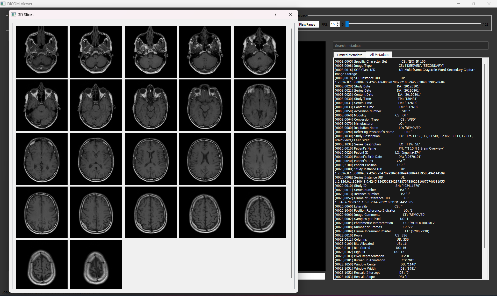
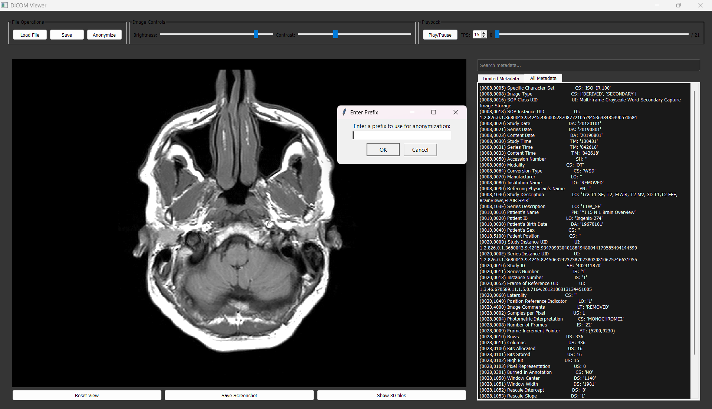
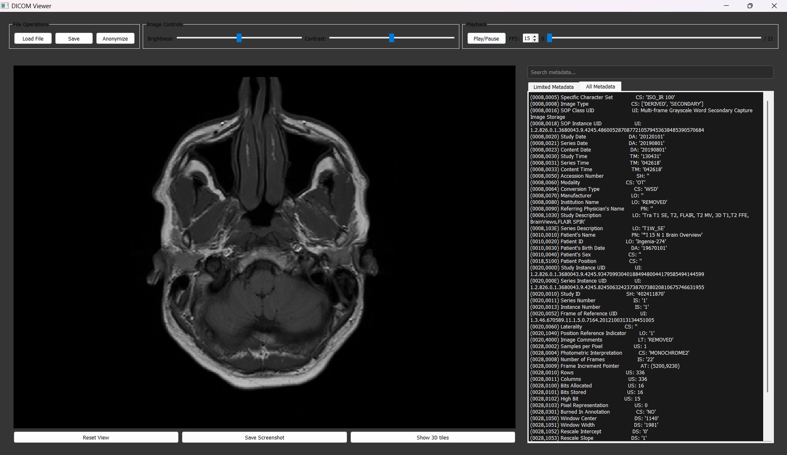

# DICOM Viewer

A Python-based DICOM (Digital Imaging and Communications in Medicine) file viewer, designed to load, display, and interact with 2D, M2D and 3D medical imaging data. The application provides tools for anonymizing patient data and displaying metadata, along with a Cine Play feature for multi-frame images.

### File Operations
- **🖼️ Load DICOM Files**: Load DICOM files in 2D, M2D, or 3D formats.
- **🕵️‍♂️ Anonymize Data**: Anonymize sensitive patient data with user-defined prefixes.

### Visualization Tools
- **🎞️ Cine Play**: Play through multi-frame DICOM files for dynamic imaging.
- **📐 3D Slice Viewer**: Visualize 3D slices from 3D DICOM data as tiles.
- **☀️ Adjust Brightness and Contrast**: Adjust brightness and contrast using sliders.
- **🔍 Zooming**: Zoom in and out using the touchpad or mouse.

### Utilities
- **📋 Display Metadata**: View metadata in a tabbed format.
- **📸 Screenshots**: Capture images of the displayed data.
  
## Requirements

- Python 3.x
- Libraries:
  - PyQt5
  - Pillow (PIL)
  - pydicom
  - numpy
  - matplotlib
  - pyqtgraph

You can install all dependencies using the `requirements.txt` file.

## Installation

1. Clone the repository:
   ```bash
   git clone https://github.com/AbdelMoety/DICOM-Viewer.git
2. Navigate to the project directory:
   cd DICOM-Viewer
3. Create a virtual environment and activate it:
   python -m venv venv
   source venv\Scripts\activate
4. Install dependencies:
   pip install -r requirements.txt

## Usage

1. Load a DICOM File: Click the "Load File" button and select a DICOM file.
2. Cine Play: For multi-frame DICOM files, use the "Cine Play/Pause" button to start/stop the playback.
3. Anonymize Data: Click the "Anonymize" button and provide a prefix for anonymizing patient information.
4. View Metadata: Access metadata by clicking on the "Limited Attributes" and "All Attributes" tabs.
4. 3D Slice Viewer: For 3D DICOM data, click "Show 3D slices" to view the individual slices as tiles.

## **Screenshots**

### 3D_tiles


### Anonymization


### metaData


## **Video**


## **License**

This project is licensed under the MIT License.

## **Acknowledgments**

Built using PyQt5 and other powerful Python libraries.